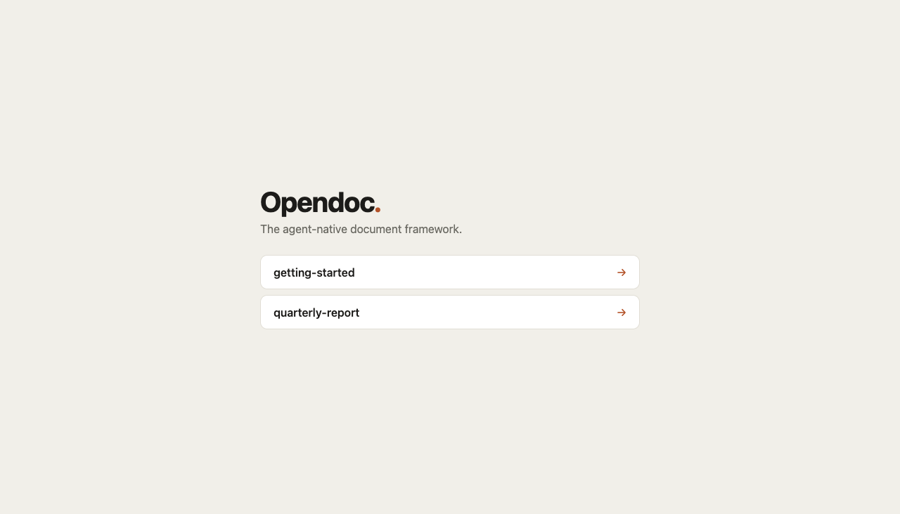
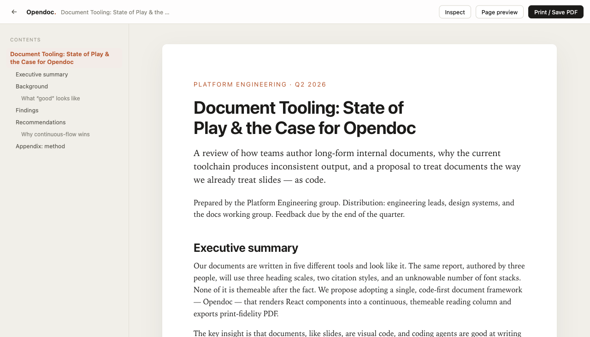
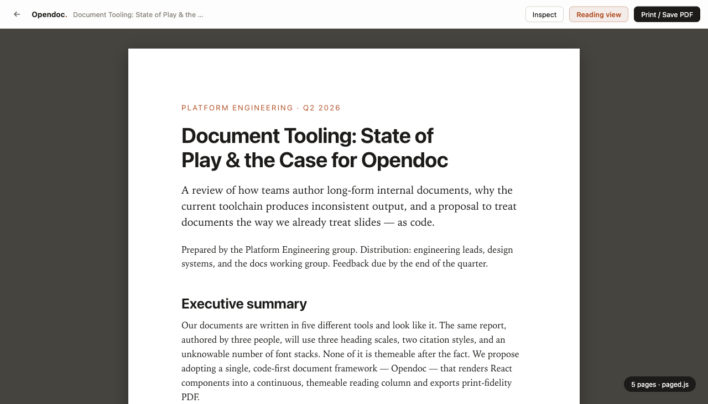

# Opendoc

**The agent-native document framework — the document analog of [open-slide](https://github.com/1weiho/open-slide).**

Author long-form documents (reports, specs, memos, papers) as React components. Opendoc owns
layout, theming, the table of contents, and print-fidelity PDF; you own the content. A document is
a folder under `docs/` whose `index.tsx` default-exports an array of section components — array
order is reading order. That's the whole contract.

```tsx
// docs/quarterly-report/index.tsx
import { Heading, Lead, Prose, type Section, type DocMeta } from '@opendoc/core';

const Cover: Section = () => (
  <>
    <Heading level={1}>Q2 Report</Heading>
    <Lead>What changed this quarter and why.</Lead>
    <Prose>…</Prose>
  </>
);
Cover.id = 'cover';

export const meta: DocMeta = { title: 'Q2 Report', createdAt: '2026-06-19T12:00:00Z' };
export default [Cover] satisfies Section[];
```

## Run the demo

```bash
npm install          # from the repo root (npm workspaces)
npm run dev          # → opendoc dev in apps/demo → http://localhost:5173
```

Open a document, then:
- **Reading view** — one continuous, themed, scrolling column (real text, no `transform: scale()`).
- **Page preview** — paged.js fragments the same content into real Letter/A4 pages, with a running
  header and page-number folios.
- **Print / Save PDF** — `window.print()` with the same `@page` + page-break rules.
- **Export ▾** — self-contained HTML, Markdown, or Word (`.docx`).
- **Inspect** (dev) — click any block to **edit its text**, apply quick styles (bold / size /
  color), or leave a `@doc-comment` — all written to the exact source file + line (across section
  files and framework components), with **undo / redo**.
- **Assets** (dev) — browse the document's `assets/` folder with image previews.
- **Themes** — pick a built-in theme via `meta.theme` (`/themes` gallery) or export a custom `design`.

Install the agent skills into the workspace with `opendoc sync` (→ `.claude/skills/`):
`create-doc`, `doc-authoring`, `apply-comments`, `current-doc`, `create-theme`.





## Layout

```
opendoc/
├─ packages/core/         @opendoc/core — runtime SPA, Vite plugin, CLI
│  ├─ bin/opendoc.mjs      CLI entry (runs TS via tsx — no build step)
│  ├─ skills/             create-doc, doc-authoring, apply-comments, current-doc, create-theme
│  └─ src/
│     ├─ index.ts          public API: Section/DocMeta/primitives/design/themes/useSectionNumber
│     ├─ sdk.ts            the doc module contract (Section, DocModule, CONTENT_WIDTH, PageSize)
│     ├─ design.ts         --odc-* design tokens + built-in theme presets + resolveDesign
│     ├─ primitives.tsx    Heading, Lead, Prose, List, Figure, Callout, Table, PageBreak, Footnote…
│     ├─ cli/              dev / build / preview / sync
│     ├─ vite/             opendoc-plugin (discovery), loc-tags, inspector-api (edit/undo/redo),
│     │                    current-plugin (.opendoc/current.json), assets-plugin
│     └─ app/              runtime: DocSurface, DocBody, Toc, PagePreview, Inspector, AssetsPanel,
│                          lib/export (HTML/Markdown/DOCX)
└─ apps/demo/             a sample workspace: docs/*, opendoc.config.ts
```

## How it works

- **Discovery** — a Vite plugin globs `docs/<id>/index.tsx` into `virtual:opendoc/docs`
  (`docIds` + a `loadDoc(id)` dynamic-import switch), with HMR.
- **Rendering** — `DocBody` mounts all sections concatenated; `DocSurface` is the `[data-odc-doc]`
  theming root at a fixed measure (no canvas, no scale). Pages exist only at export.
- **Inspector** — a `enforce:'pre'` loc-tags plugin injects `data-odc-loc` onto JSX under `docs/`;
  the overlay resolves the clicked element via the React fiber chain and posts to a dev-only
  middleware that splices the marker back into source.

All milestones M0–M6 are implemented and verified in dev and production build. Two validation
spikes (`prototype/`, `inspector-spike/`) de-risked the rendering model and the click-to-source
inspector before the full port. Known scope-downs: headless-PDF CLI, file-based theme discovery,
asset upload / svgl, and image-crop ops.

## Scripts

| Command | Effect |
| --- | --- |
| `npm run dev` | dev server for `apps/demo` (`opendoc dev`) |
| `npm run build` | static build of the demo (`opendoc build`) |
| `npm run typecheck` | type-check `@opendoc/core` |
| `opendoc sync` | install the agent skills into `.claude/skills/` (run in a workspace) |

## License

[Apache-2.0](LICENSE) © Daniel Lee. Inspired by [open-slide](https://github.com/1weiho/open-slide).
